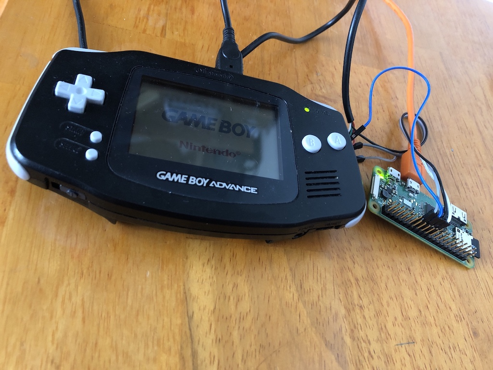

# GBA Multiboot uploader for Raspberry pi 
This is a Python port of the project hosted [here](https://github.com/akkera102/gba_01_multiboot).
This Python script can be used to upload a multiboot ROM to a Gameboy Advance using the link cable.

Multiboot is used by games like Mario Kart to play the game with other players, without having to use a game for each device. Instead, the link cable is used to boot the other GBA devices.

Development kits like DevkitPro have the option to compile for multiboot. This tool can be used to upload the rom to a console.




## Requirements 
 * WiringPi (Python)
 * Python 3

## Wiring
[Source](https://github.com/akkera102/gba_01_multiboot)

```
GBA connector(cable side).  

  T
1 3 5         1 3v, xxx 3 SI, wht 5 SC, red
2 4 6         2 SO, blk 4 SD, grn 6 GN, xxx`

Connect to:

6-GND     GND
3-SI      (SPI_MOSI)
2-SO      (SPI_MISO)
5-SC      (SPI_SCLK)
```


## Usage 

`python3 multiboot.py filename.gba`

Make sure the rom is a multiboot rom.


